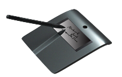

# ESP370U



Javascript library for Hanvon [ESP370U](http://www.signpro.com.cn/en/products/signsmall/sign_370U.html) E-signature display based on [WebHID API](https://developer.mozilla.org/en-US/docs/Web/API/WebHID_API):

- **Plug and play**, no os-drivers or browser-extensions required.
- **Cross platform**, running on any morden browsers supports **WebHID API** on any operating system.
- Support send commands to device, eg [`open`](#open) , [`clear`](#clear) , [`close`](#close) .
- Support listen events from device, eg [`ready`](#ready) , [`resign`]() , [`confirm`]() , [`up`]() , [`move`]() , [`down`]()
- Events contains raw and normalized data of [`X`](#x) coordinate, [`Y`](#y) coordinate, [`Z`](#z) pressing force.
- Almost every api of this libarary returns [Promise](https://developer.mozilla.org/en-US/docs/Web/JavaScript/Reference/Global_Objects/Promise), you can use [async](https://developer.mozilla.org/en-US/docs/Web/JavaScript/Reference/Operators/await) operator as you wish.

## Install

```sh
npm install esp370u
```

simply [import](https://developer.mozilla.org/en-US/docs/Web/JavaScript/Reference/Statements/import) it in [ES Modules](https://developer.mozilla.org/en-US/docs/Web/JavaScript/Guide/Modules) supported environment:

```js
import { ESP370U } from 'esp370u';
```

or drictly using it without module system by adding the self excute script [index.iife.js](https://unpkg.com/esp370u/dist/index.iife.js):

```html
<html>
  <body>
    <script src="node_modules/esp370u/dist/index.iife.js"></script>
    <script>
      const { ESP370U } = esp370u;
    </script>
  </body>
</html>
```

## Examples

- Link: https://sherluok.github.io/ESP370U/
- Code: ./docs/index.html

To get started quickly, you can use [emulate()](#emulate):

```ts
import { emulate } from 'esp370u';

const destroyEmulator = emulate(canvasElement, {
  unsupportedWebHIDAPI: ['Your browser does not support', 'the WebHID API'],
  unconnectedDevice: ['Your device is not connected yet', 'Click me to connect ESP370U'],
  onConfirm: (blob) => {
    destroyEmulator(); // Optional if you want continuous signs.
    const previewURL = URL.createObjectURL(blob);
    window.open(previewURL);
  },
});
```

## Commands

### `send()`

> `send(command: string | ArrayLike): Promise<void | TimeoutError>`

The `send()` method send a command and returns a [Promise](https://developer.mozilla.org/en-US/docs/Web/JavaScript/Reference/Global_Objects/Promise). The command argument is any [ArrayLike]() data that will be transform into [Uint8Array]() then send to device by [WebHID API](). It return a *Promise* that will be resolved after the device replies this command you send. The command argument can also be *String*, in case it's alias of *ArrayLike* data, including:

#### `open`

Alias of `send([0x55])`

#### `close`

Alias of `send([0x55])`

#### `clear`

Alias of `send([0x55])`

```js
const esp370u = new ESP370U();

esp370u.send("open").then(async () => {
  await esp370u.send("clear");
  await esp370u.send("close");
});
```

## Events

### `on()`
> `on(type: string, listener: (e: Event) => void): TeardownLogic`

### `off()`
> `off(type: string, listener: (e: Event) => void): void`

### `once()`
> `once(type: string, timeout?: number): Promise<Event | TimeoutError>`

```tsbb
try {
  const event = await esp370u.once('ready', 1000);
  console.log('connected.');
} catch (error) {
  if (error instanceof TimeoutError && error.type === 'ready') {
    console.log('Unable to connect device after %d milliseconds!', error.timeout);
  }
}
```

### `emit()`
> `emit(type: string, e: Event)`

#### `ready`
#### `resign`
#### `confirm`
#### `up`
#### `down`
#### `move`
#### `?`

listen to all events not listed above.

#### `*`

listen to all events from device.[onreportinput](https://developer.mozilla.org/en-US/docs/Web/API/HIDDevice/oninputreport). Note that this event listener has the **highest** priority, so it will fire before any other event types. By default the event will be pass to other event listeners, call [e.stop(#stop)]() method to prevent this behavior.

```ts
esp370u.on('*', (e) => {
  if (e.getUint8(0) === 0x88) {
    e.stop();
  }
});
```

## InputEvent

A [DataView]() containing the [data](https://developer.mozilla.org/en-US/docs/Web/API/HIDInputReportEvent/data) from the device input report:

```ts
esp370u.on('*', (e) => {
  const [command, x, y, z] = [
    e.getUint8(0),
    e.getUint32(1),
    e.getUint32(3),
    e.getUint32(5),
  ];
});
```

### `normalize()`

The `normalize()` method on `InputEvent` object returns [StylusData](#stylusdata):

```ts
esp370u.on('move', (e) => {
  const { x, y, z } = e.normalize();
});
```

## StylusData

Object containing stylus's normalized coordinates and pressure data.

### `x`

**Float** between `0 ~ 1.0` meaning:

```ts
const x = e.getUint32(1) / ESP370U.MAX_X;
```

### `y`

**Float** between `0 ~ 1.0` meaning:

```ts
const y = e.getUint32(3) / ESP370U.MAX_Y;
```

### `z`

**Float** between `0 ~ 1.0` meaning:

```ts
const z = e.getUint32(5) / ESP370U.MAX_Z;
```

## TimeoutError

### `type`
### `timeout`
